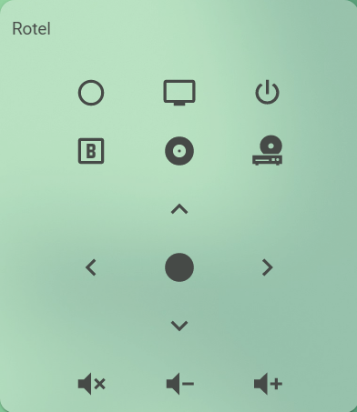

**Sample overview:**



Add this to your lovelace configuration:

```yaml
type: 'custom:rotel-card'
name: Rotel
entity: sun.sun
down:
  service: broadlink.send
  service_data:
    host: 192.168.1.53
    packet: >-
      JgBIAAABJpQRORE4ERQRExITERQRFBE4ERQROBITERQROBE4EhMRFBEUERMSExE4EjgRFBE4ERQROBE5ETgRFBETEjgRFBE4EQANBQ==
```

Look at [README](https://github.com/marrobHD/rotel-card/blob/master/README.md) for more information
